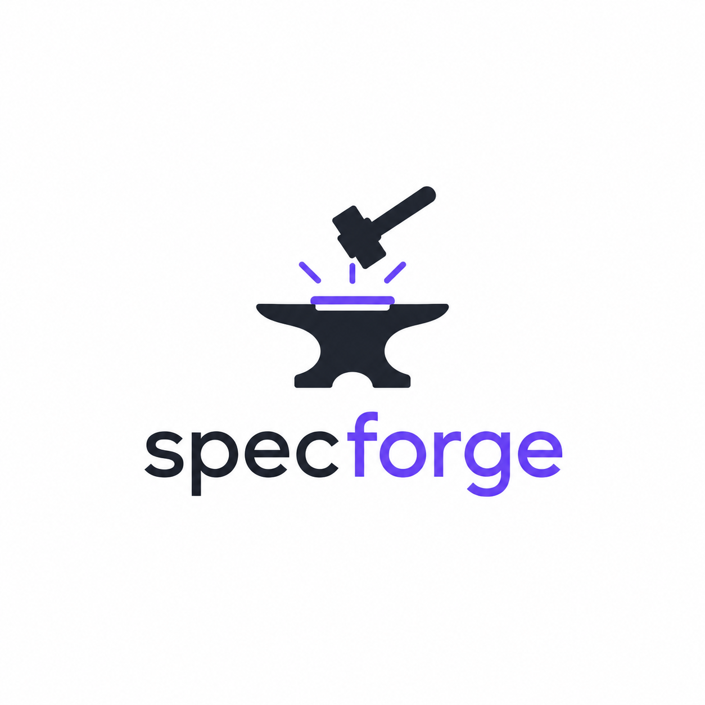

<div align="center">



# SpecForge

**Knowledge First. Specs, harness e tasks derivam do conhecimento.**

Preserve o conhecimento do seu projeto e transforme-o em specs, harness e tasks
rastreáveis — direto no navegador, local-first, com a sua própria chave da Anthropic.

</div>

---

## O que é

O **SpecForge** trata **conhecimento como o ativo primário**. Specs, harness e
tasks são artefatos _derivados e rastreáveis_. O fluxo é:

```
Intenção → Clarificação → Conhecimento → Specs → Harness → Tasks → Código
```

No **workspace** (`/projects`) você:

- **Captura conhecimento durável:** Discoveries, Decisions (com racional),
  Product DNA e Constraints — nada some no chat.
- **Clarifica:** a IA levanta as lacunas priorizadas; as respostas viram conhecimento.
- **Gera specs em cascata:** Requisitos → Design → Arquitetura → Contratos →
  Edge Cases → Segurança → Testes, cada uma rastreável às suas origens.
- **Gera o harness** (provider-neutro) e os **4 artefatos de saída**:
  `CLAUDE.md`, `.cursor/rules`, `GPT_INSTRUCTIONS.md`, `GEMINI_INSTRUCTIONS.md`.
- **Gera tasks** (grafo com dependências e critérios de aceite).
- **Exporta** tudo num `.zip` (com `specforge.json` para reimportar).

## Como funciona

- 🧊 **100% estático** — `next build` (`output: "export"`). Sem backend, banco,
  login ou variáveis de ambiente.
- 🗃️ **Local First** — projetos vivem no **IndexedDB** do navegador, versionados,
  com export/import como arquivos. O conhecimento é seu.
- 🔑 **BYOK** — a geração roda **no seu navegador**: o browser chama a Anthropic
  direto, com a sua chave. Sem servidor no meio (logo, **sem timeout**).
- 🔒 **Privado** — a chave fica só no `localStorage`. **Nunca** passa por um
  servidor nosso.

> Modelo de geração: **Claude Opus 4.8** (`claude-opus-4-8`).

## Arquitetura (camadas)

- **Domínio** (`lib/domain/`) — objetos de conhecimento, specs, harness, tasks,
  IDs rastreáveis (`DISC-`, `DEC-`, `SPEC-`…) e checagem de integridade de
  rastreabilidade.
- **Storage** (`lib/storage/`) — repositório local-first (IndexedDB versionado +
  histórico) e export/import.
- **Providers** (`lib/providers/`) — abstração de geração (Anthropic, BYOK) +
  adapters de saída puros (Claude/Cursor/GPT/Gemini).
- **Engine** (`lib/engine/`) — clarificação, geração de conhecimento, specs em
  cascata, harness, tasks e quality gates.
- **Plugins** (`lib/plugins/`) — registry in-process (tipos de spec, validators,
  providers, adapters): núcleo fechado para modificação, aberto para extensão.
- **Workspace** (`lib/workspace/` + `components/workspace/`) — store Zustand e UI.

## Stack

Next.js 14 (App Router, export estático) · TypeScript · Tailwind CSS ·
`@anthropic-ai/sdk` (no cliente) · `idb` (IndexedDB) · Zod · JSZip · Shiki · Zustand

## Rodando localmente

```bash
npm install
npm run dev
```

Abra <http://localhost:3000>, vá em **Configurações** e cole a sua chave da
Anthropic (`sk-ant-...`). Crie uma em
[console.anthropic.com](https://console.anthropic.com) → _API Keys_.

## Build & Deploy

```bash
npm run build   # gera a pasta out/ (site estático)
```

Hospede o conteúdo de `out/` em qualquer host estático (Vercel, Cloudflare
Pages, GitHub Pages, Netlify).

## Scripts

| Comando             | O que faz                          |
| ------------------- | ---------------------------------- |
| `npm run dev`       | Servidor de desenvolvimento        |
| `npm run build`     | Build estático (gera `out/`)       |
| `npm run test`      | Testes (Vitest)                    |
| `npm run lint`      | ESLint                             |
| `npm run typecheck` | Checagem de tipos (TypeScript)     |

## Privacidade & Segurança

- A chave da Anthropic é **sua** e fica **só no seu navegador**.
- A geração é uma chamada direta **navegador → Anthropic**.
- Conteúdo do usuário é tratado como **dado** nos prompts (anti prompt injection);
  o `.zip` remove path traversal (anti zip-slip).
- Use sempre via **HTTPS** em produção.
